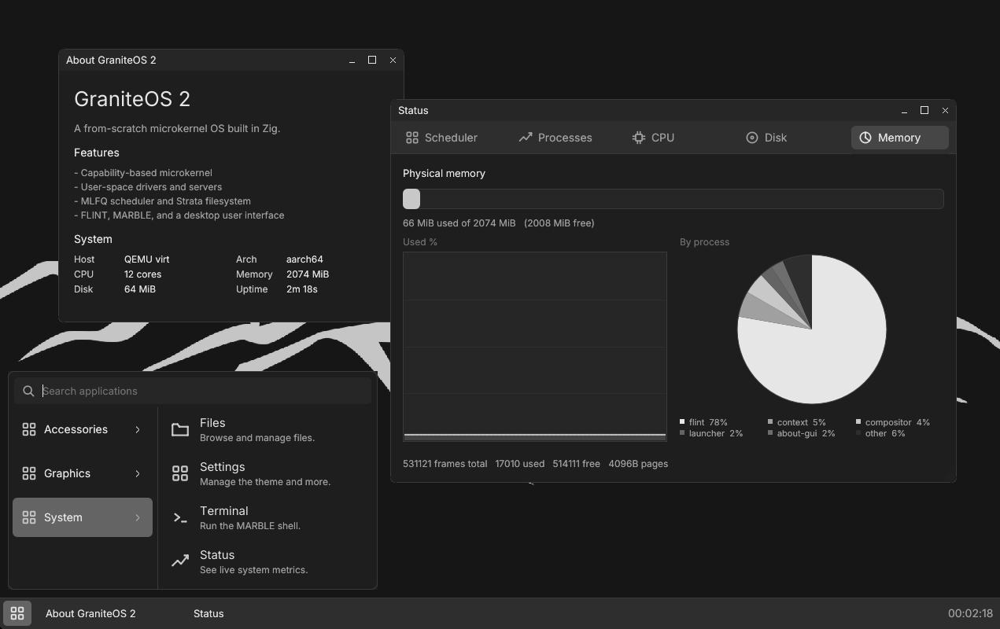

# GraniteOS 2

A from-scratch **microkernel** rewrite of GraniteOS for ARM64 (and, later,
x86_64). The kernel keeps only address spaces, threads & scheduling, IPC,
interrupt dispatch, and capabilities; the filesystem, block and display drivers,
and the compositor become user-space servers. The system is SMP-capable and
ships with a persistent on-disk filesystem plus an optional (but highly recommended) virtio-gpu desktop.

[](_docs/desktop_demo.png)

## Requirements

- **Zig 0.15** (tested with 0.15.2)
- **QEMU** with `qemu-system-aarch64`.

## Build and run

```sh
zig build # kernel image + user module bundle + persistent disk seed (zig-out/bin)
zig build qemu # boot the full system under QEMU virt (interactive; quit with Ctrl-A x)
zig build qemu-gui # SDL desktop with virtio GPU, input, and sound
zig build qemu-nodisk # boot without a virtio-blk disk (the filesystem reports unavailable)
zig build qemu-bare # boot the kernel alone; halts after initialization
zig build qemu-debug # boot halted with a gdb stub on :1234
zig build test # host unit tests for the kernel core and the user runtime
```

QEMU run steps accept `-Dsmp=<cores>`, `-Dmemory=<MiB>`, and `-Ddisk=<MiB>`
to size the virtual machine and persistent disk image (defaults: 4 cores,
512 MiB RAM, 64 MiB disk). The default disk is `disk.img`; non-default sizes
use `disk-<MiB>M.img`. A virtio-net NIC on QEMU's user-mode network is attached
by default; pass `-Dnet=false` to boot without one.

`zig build qemu` boots, discovers the machine from the device tree, logs each
subsystem as it comes up (memory, interrupts, objects, and the SMP scheduler),
then hands off to Flint. Flint loads bundled ELF programs for the name service,
console and block/display drivers, the filesystem server, Marble (the
interactive shell), and utilities (`echo`, `cat`, `help`, `ls`, `write`, …).
When a virtio-blk disk is present, programs are also installed on the persistent
filesystem. If virtio-gpu hardware is present (`zig build qemu-gui`), Flint
starts the display and input drivers, the compositor, the launcher, and a
welcome desktop with taskbar chrome. GUI boots also expose a VirtIO Sound output;
the Audio app and `play <file.wav>` support PCM WAV files with 8- or 16-bit mono
or stereo samples at standard VirtIO sample rates. A virtio-net NIC is attached by
default (disable with `-Dnet=false`); Flint starts the net driver and the netstack
server, a userspace ARP/IPv4/ICMP/TCP stack reachable at `10.0.2.15` on QEMU's
user-mode network, and `fetch <ip> <port> [path]` does a real HTTP/1.0 GET over it
(the host itself is reachable from the guest at `10.0.2.2`; `-netdev`'s
`hostfwd=tcp::5555-:5555` reaches a guest listener from the host). Type `exit` at
the `marble [/] >` prompt to watch the supervisor restart Marble; quit QEMU with
`Ctrl-A` then `x`.
`scripts/m6.sh` drives Marble over serial; `scripts/m9.sh` tests the GUI
stack.

## Layout

Assembly and Zig never share a directory: each arch keeps its non-Zig toolchain
inputs (`.S` sources and the linker script) in an `asm/` subdirectory, so the
arch directory itself is Zig-only.

```
build.zig                 kernel + user ELFs + bundle/flatten/seedisk tools + QEMU run steps
build/discover.zig        build-time user-module scan and app-catalog generation
tools/flatten.zig         host tool: ELF -> load-faithful flat image
tools/bundle.zig          host tool: user module bundle packer
tools/seedisk.zig         host tool: format and seed the persistent virtio disk
kernel/
  main.zig                post-arch entry; machine discovery; subsystem init; hand-off
  config.zig              compile-time tunables
  error.zig               shared Error set + ABI mapping
  types.zig               arch-free address types
  inspect.zig             kernel inspection surface for user-space status tools
  tests.zig               host unit-test aggregator
  arch/
    arch.zig              the architecture boundary
    host.zig              host-test stand-in for the boundary
    aarch64/
      asm/
        start.S           early boot: EL1, stack, BSS, vectors, MMU enable
        vectors.S         exception vector table
        switch.S          context switch + fresh-thread trampoline
        linker.ld         image layout
      boot.zig            bridge from start.S into Zig
      mmu.zig             seed map, MMU enable, page-table surface
      trap.zig            trap entry: IRQ -> scheduler tick; else diagnose + halt
      cpu.zig             core id, barriers, interrupt mask, halt
      context.zig         thread context: init + switch surface
      gic.zig             GICv3 distributor + per-core redistributors
      timer.zig           ARM generic timer: monotonic time + deadline
      psci.zig            PSCI CPU_ON for secondary-core bring-up
    board/virt.zig        board fallback constants (UART, GIC windows)
  boot/
    dtb.zig               device-tree parse: memory, cores, intctrl windows
    handoff.zig           kernel -> Flint argument packing
    smp.zig               secondary-core entry and scheduler attach
    bundle.zig            Flint-module lookup inside the initrd bundle
  memory/
    frames.zig            buddy physical-frame allocator
    slab.zig              per-type object caches
    region.zig            Region: a run of RAM frames
    address_space.zig     AddressSpace: page tables, map/unmap/activate
  object/
    object.zig            common object header (kind + refcount)
    process.zig           Process: AddressSpace + HandleTable + threads
    thread.zig            Thread: context, state, scheduling
    endpoint.zig          IPC endpoint object
    interrupt.zig         interrupt object + delivery
    notification.zig      notification object for async wakeups
  cap/
    handle.zig            Handle {index, generation}
    handle_table.zig      per-process handle table
  authority/              capability-grant authorities (memory, device, DMA, …)
  ipc/                    kernel-side message transfer
  sync/                   kernel spinlocks and IPC helpers
  syscall/                syscall dispatch surface
  sched/
    runqueue.zig          intrusive per-core queues
    scheduler.zig         MLFQ + driver class, tick, demote/boost, yield
  debug/
    console.zig           panic-only PL011 UART
    panic.zig             panic diagnostic + halt
user/
  flint/main.zig          boot supervisor; spawns servers, drivers, and Marble/GUI
  marble/main.zig         interactive shell
  lib/
    root.zig              user runtime entry; re-exports submodules
    cap/                  handle indices and grant layouts
    ipc/                  message envelope and protocol constants
    syscall/              syscall wrappers
    runtime/              program entry and init-message handling
    boot/                 bundle reader, ELF loader, DTB parser, app catalog
    io/                   streams, logging, and formatting helpers
    fs/                   filesystem client helpers
    net/                   frame ring, address/checksum helpers, and the TCP socket client
    draw/                 raster, vector, text, and PNG drawing
    gfx/                  desktop chrome, windows, cursor, preferences
    ui/                   widgets, charts, and file-picker UI
    shell/                Marble help/about catalog
    mem/                  user-space memory helpers
  programs/common/        bundled CLI utilities (echo, cat, help, status, …)
  programs/fs/            filesystem commands (ls, write, mkdir, …)
  programs/location/      cwd helper (location)
  programs/gui/           desktop applications and chrome (welcome, taskbar, …)
  drivers/console/        PL011 console driver
  drivers/block/          virtio-blk block driver
  drivers/display/        virtio-gpu display driver
  drivers/audio/          virtio-sound PCM output driver
  drivers/net/            virtio-net driver
  servers/naming/         name service
  servers/filesystem/     on-disk filesystem server
  servers/netstack/       ARP/IPv4/ICMP/TCP stack and socket server
  servers/display/        compositor and window manager
  servers/input/          virtio-input multiplexer
  servers/launcher/       GUI program launcher
```
