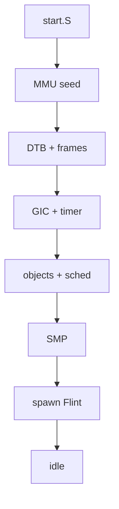
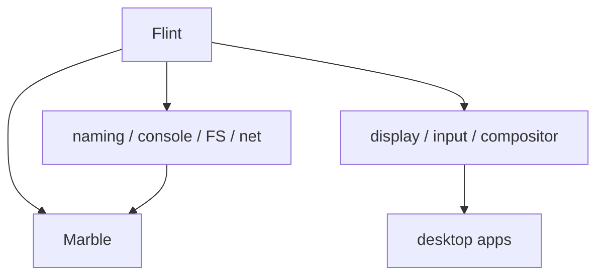
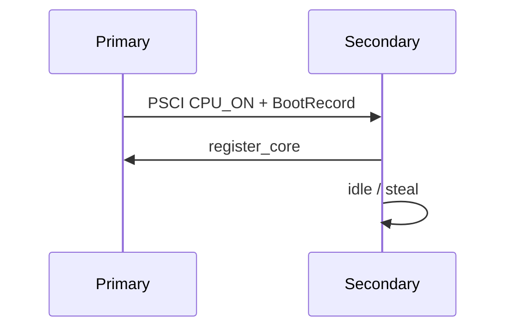
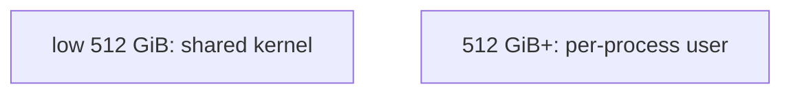
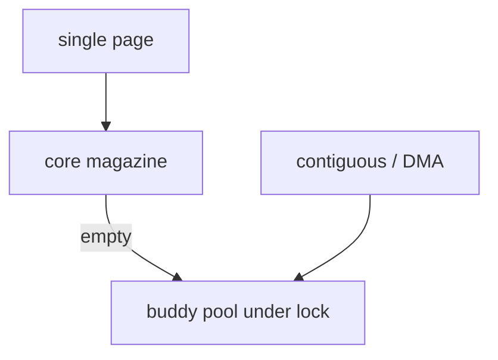
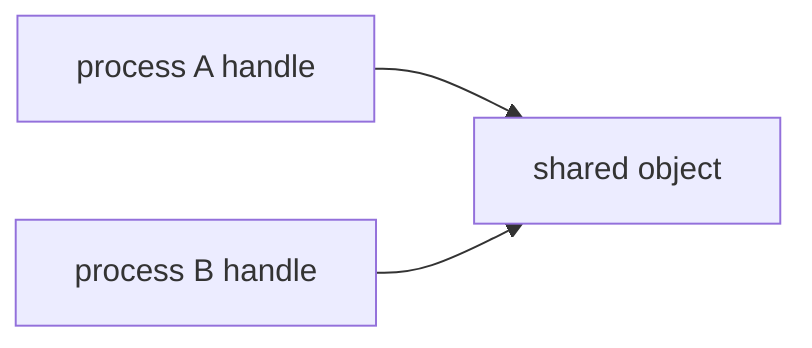
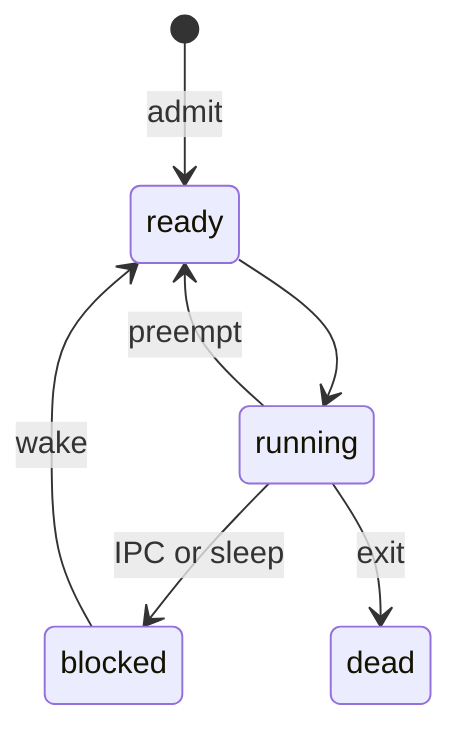
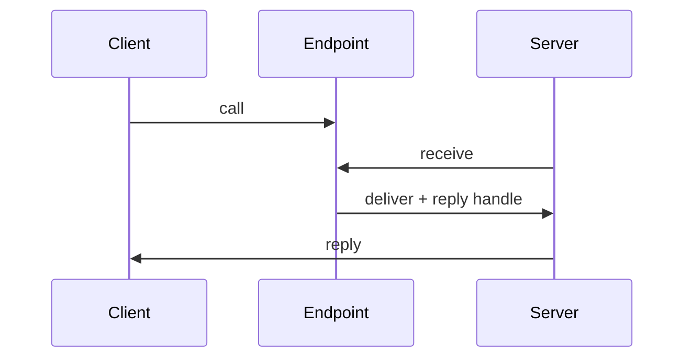
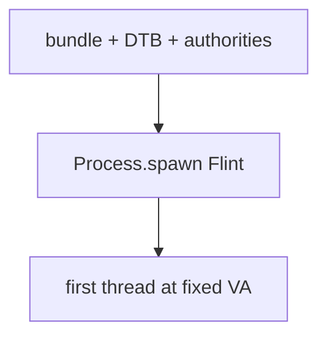
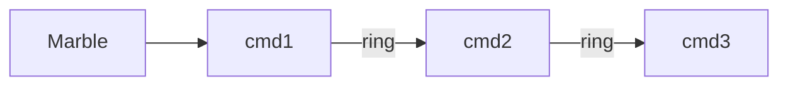

# GraniteOS 2

## Overview & Implementation

---

## Table of Contents

1. [Overview](#overview)
2. [Modules](#modules)
   - [Kernel modules](#kernel-modules)
   - [User-space modules](#user-space-modules)
   - [Host-side modules](#host-side-modules)
3. [Per-Module Dependencies](#per-module-dependencies)
4. [Boot and Startup](#boot-and-startup)
   - [The machine](#the-machine)
   - [Bootloader assembly](#bootloader-assembly)
   - [From assembly into Zig](#from-assembly-into-zig)
   - [Device tree as machine truth](#device-tree-as-machine-truth)
   - [Module bundle](#module-bundle)
   - [Secondary core initialization](#secondary-core-initialization)
5. [Architecture Layer](#architecture-layer)
   - [Exception vectors](#exception-vectors)
   - [Trap handling policy](#trap-handling-policy)
   - [MMU and address layout](#mmu-and-address-layout)
   - [GIC and timer](#gic-and-timer)
   - [Context switch](#context-switch)
6. [Memory Management](#memory-management)
   - [Physical frame allocator](#physical-frame-allocator)
   - [Slab caches](#slab-caches)
   - [Regions](#regions)
   - [Address spaces](#address-spaces)
   - [What user code sees](#what-user-code-sees)
7. [Objects and Capabilities](#objects-and-capabilities)
   - [Object header](#object-header)
   - [Processes](#processes)
   - [Threads](#threads)
   - [Endpoints, notifications, interrupts](#endpoints-notifications-interrupts)
   - [Handles](#handles)
8. [Authorities](#authorities)
   - [MemoryAuthority](#memoryauthority)
   - [InterruptAuthority, DeviceAuthority, DmaAuthority](#interruptauthority-deviceauthority-dmaauthority)
   - [Why this exists](#why-this-exists)
9. [Scheduling](#scheduling)
   - [Per-core state](#per-core-state)
   - [MLFQ policy](#mlfq-policy)
   - [Admission, stealing, and IPIs](#admission-stealing-and-ipis)
   - [IPC priority donation](#ipc-priority-donation)
   - [Sleep and zombies](#sleep-and-zombies)
10. [Inter-Process Communication](#inter-process-communication)
    - [Message envelope](#message-envelope)
    - [Transfer paths](#transfer-paths)
    - [Handle transfer and move](#handle-transfer-and-move)
    - [Attach-once buffers](#attach-once-buffers)
    - [What IPC is not](#what-ipc-is-not)
11. [System Calls](#system-calls)
    - [ABI basics](#abi-basics)
    - [List of system calls](#list-of-system-calls)
    - [Create kinds](#create-kinds)
    - [Notable design points](#notable-design-points)
12. [Synchronization](#synchronization)
13. [Kernel Hand-Off](#kernel-hand-off)
14. [Flint - The First Process](#flint----the-first-process)
    - [Startup sequence](#startup-sequence)
    - [Hardware probing](#hardware-probing)
    - [Budgets and grants](#budgets-and-grants)
    - [Supervision](#supervision)
15. [Name Service and Discovery](#name-service-and-discovery)
16. [Service Protocols](#service-protocols)
    - [Common rules](#common-rules)
    - [Identify](#identify)
    - [Stream](#stream-strm)
    - [Name](#name-name)
    - [Block](#block-blok)
    - [Filesystem](#filesystem-fsvr)
    - [Display](#display-disp)
    - [Window](#window-wndw)
    - [Launch](#launch-lnch)
    - [Input](#input-inpt)
    - [Net](#net-net1)
    - [Socket](#socket-sock)
    - [Audio](#audio-audi)
    - [Entropy](#entropy-entr)
    - [Metrics](#metrics-metr)
    - [Supervisor death](#supervisor-death)
17. [Drivers](#drivers)
    - [Common pattern](#common-pattern)
    - [Console, block, display, input, net, audio, rng](#console-pl011-uart)
18. [Servers](#servers)
    - [Filesystem and Strata](#filesystem-and-strata)
    - [Netstack](#netstack)
    - [Compositor / window manager](#compositor--window-manager)
    - [Launcher](#launcher)
    - [Metrics](#metrics)
19. [User Library](#user-library)
    - [Runtime entry and init messages](#runtime-entry-and-init-messages)
    - [Syscall wrappers and capabilities](#syscall-wrappers-and-capabilities)
    - [IPC helpers](#ipc-helpers)
    - [Filesystem, net, draw, UI](#filesystem-and-path-helpers)
20. [Marble - The Shell](#marble----the-shell)
21. [Programs and Desktop](#programs-and-desktop)
22. [Build System](#build-system)
23. [Software Distribution](#software-distribution)
24. [Constraints and Limitations](#constraints-and-limitations)
25. [Comparison With GraniteOS 1](#comparison-with-graniteos-1)
26. [Concluding Remarks](#concluding-remarks)
27. [Appendices](#appendix-a--key-compile-time-constants)

---

## Overview

GraniteOS 2 is a from-scratch rewrite of GraniteOS for ARM64 processors. It is tested and run primarily on the QEMU `virt` machine. The kernel and almost all of user space are written in Zig. Early boot and a few hot paths are written in ARM64 assembly. Unlike the first GraniteOS, which was a small monolithic kernel of roughly ten thousand lines, GraniteOS 2 is a **capability-based microkernel**: the kernel keeps only what cannot safely live outside it, and everything else -- filesystem, drivers, networking, compositor, shell -- runs as ordinary user-space processes that talk through IPC.

The design change is the whole point of the rewrite. In GraniteOS 1, file systems, VirtIO drivers, signals, and a large syscall surface all lived inside the kernel. That made the system easy to reason about at ten thousand lines, but it also meant a bug in the filesystem or a driver fault could take down the machine. GraniteOS 2 pulls those pieces out. The kernel deals in address spaces, threads, scheduling, interrupts as objects, and capability-mediated IPC. The first user process, **Flint**, holds the root of all authority and starts the rest of the world.

The implementation is substantially larger than the original. A rough breakdown of the live source (excluding large third-party decoder trees and build caches) is on the order of:

- ~6,000 lines of Zig and assembly for the kernel
- ~40,000 lines of Zig for user space (runtime library, drivers, servers, shell, GUI, utilities)
- Build tools, host launcher, SDK, and a software repository server in Zig and Go

GraniteOS 2 is complete in the classical microkernel sense: it virtualizes hardware, enforces process isolation, manages memory and interrupts, schedules threads across multiple cores, and provides a narrow syscall interface so user programs can only touch what their handles allow. On top of that it runs a persistent on-disk filesystem, a userspace network stack with HTTP and HTTPS, a full desktop compositor, and an optional third-party software channel.

The codebase is organized into a few top-level areas:

- **kernel/** -- the microkernel itself
- **user/** -- Flint, Marble, drivers, servers, programs, and the shared user library
- **tools/** and **build/** -- host tools that flatten ELFs, pack the boot module bundle, and seed the disk
- **sdk/** and **repo/** -- third-party application packaging and a reference software repository
- **launcher/** -- a host-side GUI that embeds the kernel and bundle and starts QEMU for desktop demos

Overall, the codebase is organized to promote clarity. An operating system of this size is still a complex endeavor, but the microkernel boundary is deliberate: once you understand what the kernel will and will not do, each user-space server can be read almost on its own. One needs not hold the entire compositor in mind to understand how a page is allocated, and one needs not hold the buddy allocator in mind to understand how Marble pipes two programs together.

The motivation of the project is the same spirit as GraniteOS 1: a serious systems project that is also a passion project. The first version proved that a small monolithic kernel could boot, schedule, and run a shell. The second version asks what happens when you take those same ideas -- simplicity first, Zig throughout, QEMU as the machine -- and rebuild them as a capability microkernel with a real desktop and network stack.

There is a temptation, when rewriting an operating system, to chase novelty for its own sake. GraniteOS 2 tries to avoid that. Every major departure from version 1 answers a concrete problem that showed up when the first system hit its ceiling:

- Embedding all programs in the kernel image made experimentation slow.
- In-kernel VirtIO and filesystem code made driver mistakes fatal.
- A single 100 ms round-robin quantum felt coarse once more than a shell was running.
- Pipes and signals were enough for a teaching shell and not enough for a compositor and network stack.
- Ambient authority was invisible until you imagined third-party software.

The microkernel and capability model are not decorations on top of the old design. They are the response to that list. If a feature could live in user space without forcing the kernel to understand its abstractions, it was moved. If a resource was dangerous, it was gated by an authority. If two programs needed to share bulk data, they shared a Region rather than inventing a new syscall.

The writing follows the same spirit as the GraniteOS 1 implementation report: explain choices and mechanisms in order, use tables where density helps, use diagrams where topology matters, and speak plainly to a programmer who has not necessarily written an OS before but is willing to read carefully. It is longer because the system is larger, not because the prose is trying to impress.


---

## Modules

Similar to any well designed software, GraniteOS 2 uses modules to separate concerns. The correct distinction of what belongs where is a bit more subtle than in ordinary application software. Zig has no class hierarchy to lean on, and a microkernel deliberately refuses to put "filesystem" or "TCP" in the kernel at all. Selecting which files belonged to which modules was driven by a few rules:

1. **Assembly never shares a directory with Zig.** Each architecture keeps `.S` sources and its linker script in an `asm/` subdirectory so the arch directory itself stays Zig-only.
2. **The kernel core never imports architecture details directly.** Everything hardware-shaped goes through `kernel/arch/arch.zig`, which either re-exports the aarch64 implementation or a host stub for unit tests.
3. **User-space services are ordinary programs.** Drivers, servers, the shell, and GUI apps all link the same library and speak the same IPC protocols. The difference is which capabilities Flint hands them at spawn time.

### Kernel modules

| Module | Relative Path | Responsibility |
| --- | --- | --- |
| Entry | `kernel/main.zig` | Discover the machine, init subsystems, hand off to Flint, idle |
| Config / Types / Errors | `kernel/config.zig`, `types.zig`, `error.zig` | Compile-time tunables, address types, ABI error codes |
| Arch boundary | `kernel/arch/` | CPU, MMU, traps, GIC, timer, context switch, PSCI |
| Boot | `kernel/boot/` | Device tree, SMP, module bundle, Flint hand-off |
| Memory | `kernel/memory/` | Buddy frames, slabs, regions, address spaces |
| Objects | `kernel/object/` | Process, thread, endpoint, notification, interrupt |
| Capabilities | `kernel/cap/` | Handles and per-process handle tables |
| Authorities | `kernel/authority/` | Memory, interrupt, device, and DMA grant roots |
| IPC | `kernel/ipc/` | Message envelope and rendezvous transfer |
| Scheduler | `kernel/sched/` | Per-core MLFQ, driver band, work-steal, donation |
| Syscalls | `kernel/syscall/` | The single EL0 entry surface |
| Sync | `kernel/sync/` | Spinlocks and IPC lock-order helpers |
| Debug | `kernel/debug/` | Panic UART and halt diagnostics |
| Inspect | `kernel/inspect.zig` | Snapshots for user-space status tools |

### User-space modules

| Module | Relative Path | Responsibility |
| --- | --- | --- |
| Flint | `user/flint/` | Boot supervisor; only process the kernel loads |
| Marble | `user/marble/` | Interactive shell |
| Library | `user/lib/` | Syscalls, IPC, FS/net/TLS clients, drawing, UI, runtime |
| Drivers | `user/drivers/` | Console, block, display, audio, net, rng |
| Servers | `user/servers/` | Naming, filesystem, netstack, compositor, input, launcher, metrics |
| Programs | `user/programs/` | CLI utilities and GUI applications |
| Linker | `user/linker/user.ld` | Fixed user link base and section layout |

### Host-side modules

| Module | Relative Path | Responsibility |
| --- | --- | --- |
| Build | `build.zig`, `build/discover.zig` | Kernel + user ELFs, QEMU targets, discovery |
| Tools | `tools/` | Flatten, bundle, seedisk, qemu-run |
| SDK | `sdk/` | Third-party Zig API and publisher |
| Repo | `repo/` | Reference HTTPS software repository |
| Launcher | `launcher/` | Host desktop app that boots the guest GUI |

---

## Per-Module Dependencies

Zig makes it easy to create loosely coupled modules with a high fan-in and a low fan-out. The import pattern is simple relative paths. For example, almost every kernel subsystem that needs time or interrupts goes through the arch boundary rather than talking to the GIC or timer files directly:

```zig
const arch = @import("../arch/arch.zig");
// ...
const now = arch.now_ns();
arch.send_ipi(target_core, .reschedule);
```

Some modules have very high fan-in: the arch boundary, the scheduler, the object header, and the frame allocator. Almost everything else eventually depends on one of those.

It is also useful to think in terms of **initialization precedence** -- which subsystems must exist before others can work. That is not quite the same as a compile-time import graph. The boot path in `kernel/main.zig` is the real order of life:



**Figure 1 -- Kernel bring-up order**

User space has its own precedence graph, owned entirely by Flint after the hand-off. The kernel does not know that a filesystem or a compositor exists. Flint creates endpoints, spawns programs with carefully chosen grants, and registers names so later clients can find services without ambient authority.



**Figure 2 -- User-space service graph (simplified)**

---

## Boot and Startup

A common denominator across operating systems is a boot path that turns "firmware just handed us a CPU" into "a kernel can run and create processes." In GraniteOS 2 that path is shorter in the kernel than it was in GraniteOS 1, because the kernel refuses to load a full program table of embedded user binaries. It loads exactly one user image -- Flint -- and then gets out of the way.

### The machine

QEMU is still the primary host. The build system provides several run steps; a typical desktop boot looks roughly like:

```text
qemu-system-aarch64
  -machine virt,gic-version=3
  -cpu cortex-a57
  -smp 4
  -m 512M
  -kernel zig-out/bin/granite-kernel.bin
  -initrd zig-out/bin/bundle.img
  plus virtio-blk, virtio-net, virtio-gpu, virtio-input, virtio-sound, virtio-rng
```

Those flags put the processor into a state that resembles a privileged hypervisor with no useful memory map for us yet. Firmware (or QEMU acting as firmware) loads the kernel image, places a flattened device tree (DTB) pointer in `x0`, and optionally provides an initrd. The main job of early assembly is to get the primary core into the state the Zig kernel expects: **EL1**, a boot stack, a vector table, BSS zeroed, and then -- once Zig has built a seed map -- the MMU enabled.

### Bootloader assembly

When QEMU powers up, the CPU fetches instructions at a fixed load address. GraniteOS places an ARM64 Linux Image header and the `.text.boot` section from `kernel/arch/aarch64/asm/start.S` there. The header exists so QEMU loads the image correctly and hands the DTB in `x0`. The code immediately after the header is the first instruction of the OS.

At that moment the CPU may be in EL2. EL2 is normal for virtualized ARM systems, but the kernel is defined for EL1 only. The first real work is therefore to drop privilege if needed: set `HCR_EL2.RW` so EL1 runs AArch64, program `SPSR_EL2` and `ELR_EL2`, and execute `eret`.

The primary core then:

1. Configures `CPACR_EL1` so EL1 may use FP/SIMD registers for trap bookkeeping, while **trapping EL0 FP** until a user thread actually needs it (lazy FP context).
2. Installs the boot stack from linker symbols.
3. Points `VBAR_EL1` at the exception vector table.
4. Zeroes BSS from `__bss_start` to `__bss_end` in 8-byte strides with `xzr`.
5. Branches to `kernel_boot` with the DTB still in `x0`.

Secondary cores that reach `_start` before PSCI brings them up simply park in a `wfe` loop. Their real entry is `secondary_start`, described under SMP later.

### From assembly into Zig

`kernel/arch/aarch64/boot.zig` bridges assembly into the rest of the kernel. On the primary core it enables the boot MMU mapping, then calls `main(dtb_address)` in `kernel/main.zig`. That function is the true kernel story:

1. **Parse the device tree.** Memory banks, CPU list, GIC windows, PSCI method, and initrd bounds all come from the DTB. Hardcoding board constants is a last resort (`kernel/arch/board/virt.zig` for UART and GIC fallbacks).
2. **Map all RAM** into the identity-style kernel window and initialize the buddy frame allocator, reserving the kernel image, DTB, and initrd so they are never handed out as free frames.
3. **Initialize region and address-space object caches.**
4. **Initialize the interrupt controller and timer.**
5. **Initialize kernel objects, authorities, and the scheduler** for the discovered core count.
6. **Bring up secondary cores** via PSCI.
7. **Hand off to Flint** if an initrd/module bundle is present; otherwise halt after printing that there is nothing to run.
8. Enter `scheduler.idle()` on the primary core.

Secondary cores enter `main_secondary`, initialize their own GIC CPU interface and timer, register with the scheduler, and idle until work arrives.

### Device tree as machine truth

`kernel/boot/dtb.zig` treats the flattened device tree as the source of truth for hardware. The parsed `Machine` structure carries:

- Memory banks from `memory` / `memory@*` nodes
- Core count and per-CPU MPIDR values under `cpus`
- Interrupt controller windows from the first `arm,gic-v3` node
- Initrd start/end from `/chosen`
- PSCI conduit (`hvc` or `smc`) from `/psci`

The parser is a depth-limited FDT token walk. It is unit-tested against embedded QEMU `virt` fixtures so a change to cell sizes or node layout fails on the host before it fails on the guest. This is a deliberate design choice relative to GraniteOS 1, which leaned more on fixed board addresses: discovering the machine at runtime is what lets the same kernel binary adapt to different SMP counts and memory sizes without rebuild flags for every layout.

### Module bundle

The initrd is not a Linux-style cpio of random files. It is a small custom format defined in `kernel/boot/bundle.zig` (and mirrored in user space):

- Magic `0x444e4247` ("GBND"), version 1
- A table of entries: 24-byte name, file offset, length
- Payload bytes immediately available as slices -- no allocation required to open the bundle

The kernel opens this table only to find the **`flint`** image. Every other named module (Marble, drivers, servers, fonts, wallpapers, app catalog) stays in the same physical region, wrapped as a read-only Region capability and handed to Flint. Later loading is a user-space problem.

### Secondary core initialization

Once the primary core has a working frame allocator and PSCI method, `kernel/boot/smp.zig` brings peers online:

1. For each CPU whose affinity is not the current core and fits in `max_cores`, allocate a contiguous kernel stack.
2. Fill a `BootRecord` (`stack_top`, `core_id`) at a known physical address.
3. Clean and invalidate the data cache for that record, because the secondary core will read it with the MMU and caches still off.
4. Call `arch.start_core` (PSCI `CPU_ON`).
5. Spin until the scheduler marks the core online, or time out and free the stack.

On the secondary side, `secondary_start` drops to EL1 if needed, installs vectors, loads the stack from the BootRecord, and enters Zig. The secondary enables the shared page tables, then joins the scheduler. There is no separate "secondary does half of kernel init" path for memory or objects -- those are primary-only. Secondaries only attach to interrupt and timer hardware, then wait for work.



**Figure 3 -- SMP bring-up**

---

## Architecture Layer

The architecture layer is the only place the kernel is allowed to know it is running on aarch64. Everything above `arch.zig` speaks in `PhysAddr`, `VirtAddr`, page permissions, "send IPI", and "arm deadline." Host unit tests swap in `host.zig` so the same scheduler and IPC code can run under `zig test` on a desktop OS.

### Exception vectors

ARM64 requires a 2KB-aligned vector table. `kernel/arch/aarch64/asm/vectors.S` provides the sixteen architectural slots. In practice GraniteOS 2 cares about a small subset:

- Synchronous exceptions from EL0 -- system calls (`SVC`) and user faults
- IRQs from EL0 and EL1 -- timer ticks, SGIs, and device interrupts
- FP/SIMD traps from EL0 -- lazy floating-point context switch
- Unexpected EL1 faults -- panic with diagnostics

When a trap is taken, assembly saves enough state for either a full context switch or a syscall frame, then calls into Zig (`kernel_irq`, `kernel_syscall`, `kernel_trap`, `kernel_fp_trap` as exported from `main.zig`).

### Trap handling policy

`kernel/arch/aarch64/trap.zig` implements a deliberate fault policy that differs from many teaching kernels:

- A **timer** or **reschedule SGI** runs the scheduler tick path.
- A **device interrupt** looks up an Interrupt object for that line, signals its bound Notification, and may preempt a normal thread if a driver-class thread is waiting (driver priority).
- A **user fault** kills the faulting thread rather than panicking the whole system.
- An **EL1 fault** panics: the kernel does not try to recover from its own bad pointer.

That split is important. In GraniteOS 1, unexpected faults generally halted the machine. In GraniteOS 2, user-space is expected to crash sometimes -- a bad app should not take down the compositor or the filesystem if isolation holds.

### MMU and address layout

`kernel/arch/aarch64/mmu.zig` builds a seed map before `main` and then exposes the page-table surface used by AddressSpace objects.

The seed map is intentionally coarse:

- One L0 entry covers the first 512 GiB and points at a static L1 table of 1 GiB blocks.
- Kernel image, DTB, and UART windows are mapped as normal or device memory as appropriate.
- After DTB parse, `map_ram` extends coverage over discovered banks.

User address spaces do not start at low addresses the way they did in GraniteOS 1. The user virtual window begins at:

```text
user_space_base = 0x80_0000_0000   // 512 GiB
```

Every new user L0 table inherits the shared kernel mapping in L0 slot 0 (the low 512 GiB identity-style window) and places process-private mappings above that. Context switches load `TTBR0_EL1` with the page-table root and a 16-bit **ASID** in the high bits so process switches can avoid a full TLB flush. When the ASID space rolls over, a generation counter forces each core to flush its local TLB once.



**Figure 4 -- Kernel vs user virtual layout**

An **ASID** (Address Space ID) is a small tag stored in the high bits of `TTBR0` alongside the page-table root. The TLB can remember translations as belonging to ASID 7 vs ASID 12, so switching processes often means writing a new TTBR0 rather than flushing every cached translation. When the kernel runs out of free ASIDs, it bumps a generation and each core flushes once -- cheaper than flushing on every switch.

Translation still uses the standard four-level 4 KiB scheme. A virtual address splits into four 9-bit indices and a 12-bit page offset. Descriptors are the usual table vs page/block encodings with MAIR indices for device, normal write-back, and normal non-cacheable (DMA) memory.

### GIC and timer

GraniteOS 2 targets **GICv3**, not the GICv2 CPU interface used in the first version. Distributor and redistributor windows come from the DTB when possible. Two software-generated interrupts are reserved:

- SGI 0 -- reschedule
- SGI 1 -- halt other cores (panic path)

The ARM generic timer provides both monotonic time (`now_ns`) and one-shot deadlines. The physical timer PPI (interrupt ID 30) is **not** wrapped as a user-visible Interrupt object. It is owned by the kernel for scheduling. Device IRQs that drivers care about become Interrupt objects bound to Notifications.

### Context switch

`kernel/arch/aarch64/context.zig` and `asm/switch.S` save callee-saved registers, `SP_EL0`, and optionally a lazy FP file. Fresh threads use a trampoline:

- Kernel threads jump to an EL1 entry point on their kernel stack.
- User threads `eret` to EL0 with the argument in `x0` and a separate user stack top.

A subtle but important concurrency detail lives here: when a thread is being switched away, peers on other cores must not dispatch it until its register file is fully saved. The scheduler clears a `context_saved` flag before the switch and sets it afterward, with `WFE`/`SEV` used so waiters sleep instead of spinning hard.

---

## Memory Management

Memory management is still the foundation of everything else, but the shape is different from GraniteOS 1. There is no kernel bump-heap for arbitrary structures and no in-kernel filesystem buffers. Instead there is a buddy frame allocator, per-type slab caches for kernel objects, Region objects that represent physical spans, and AddressSpace objects that map those regions into page tables.

### Physical frame allocator

`kernel/memory/frames.zig` implements a classic buddy allocator over the RAM banks discovered from the DTB, minus reserved spans (kernel, DTB, initrd, and the allocator's own metadata bitmaps).

Design goals, in order:

1. Support **physically contiguous** allocations up to 16 MiB (`frame_max_order = 12`) for DMA and large display buffers.
2. Keep the common case -- single page allocate/free -- off the global lock via **per-core magazines** of 32 pages.
3. Never hand out reserved frames.

The free pool is a set of freelists, one per order, with intrusive `FreeNode` headers living in the free pages themselves, plus bitmaps used to find buddies for merging. Allocation of one page:

1. Disable interrupts on the local core (magazines are per-core, not lock-protected against the same core's IRQ reentry).
2. Pop from the magazine if non-empty.
3. Otherwise refill half a magazine from the global pool under `pool_lock`.
4. Return the page.

Contiguous allocation always takes the global lock, rounds the page count up to a power of two, and splits larger blocks as needed. Freeing reverses the process and may coalesce buddies all the way back up the order chain.



**Figure 5 -- Frame allocation paths**

This is a direct response to a limitation of GraniteOS 1, where physical allocation was a linear bitmap scan. The buddy system is more code, but it is the right tool once DMA and multi-megabyte surfaces exist.

### Slab caches

Kernel objects are fixed-size. `kernel/memory/slab.zig` provides a generic `Cache(T)`:

- One slab is one page.
- Free objects form a freelist inside the page.
- Partial slabs hang on a list; empty slabs return their frame.

Process, Thread, Region, AddressSpace, Endpoint, Notification, Interrupt, and the authority types all come from slabs. There is a single lock per cache rather than per-CPU slab magazines. That is a simplicity trade: object create/destroy is far less hot than single-page frame traffic.

### Regions

A **Region** (`kernel/memory/region.zig`) is a first-class capability object meaning "this contiguous physical span." Creating one does not map it; mapping is a separate AddressSpace operation.

Important fields:

| Field | Meaning |
| --- | --- |
| `base` | Physical base address |
| `pages` / `length` | Size in pages and original byte length |
| `device` | MMIO window (device memory attributes when mapped) |
| `uncached` | DMA RAM (non-cacheable normal) |
| `owns_frames` | Whether destroy returns pages to the buddy pool |
| `authority` | Optional MemoryAuthority to refund on last close |

Constructors match the authority model:

- `create` -- ordinary RAM from the buddy allocator
- `create_dma` -- RAM plus cache maintenance and uncached flag
- `create_device` -- MMIO window; never freed as RAM
- `wrap` -- non-owning view of already-reserved boot memory (DTB, module bundle)

### Address spaces

An **AddressSpace** (`kernel/memory/address_space.zig`) owns a page-table root and a fixed table of up to **64 mappings**. There is no full VMA tree and no copy-on-write yet; comments in the code mark both as deferred. For what the system actually does -- load a modest number of segments, stacks, shared IPC buffers, and MMIO windows -- 64 slots is enough and keeps the code obvious.

`map(region, at, perms)` either places the region at a caller-chosen virtual address or bumps `next_base` starting at `user_space_base`. Permissions come from the caller, but device/uncached attributes ride with the Region so a client cannot "forget" that an MMIO window needs device memory.

Activation writes `TTBR0` with root and ASID. The scheduler caches the last loaded TTBR value per core so switches within the same address space skip the reload.

### What user code sees

User processes never call "alloc page" as a raw kernel service. They:

1. Hold a MemoryAuthority handle with a byte budget.
2. `create` a Region of some length (the kernel charges the budget).
3. `map` that Region into an AddressSpace they hold (often `self_space`).

That is more ceremony than `brk` in GraniteOS 1, and that is intentional. Ambient heap growth is replaced by explicit capability-gated regions. The user library then builds a more convenient allocator on top of regions so application code does not repeat the ceremony every time.

---

## Objects and Capabilities

If there is one idea that separates GraniteOS 2 from GraniteOS 1, it is this: **kernel resources are objects, and user space names them only through handles.**

### Object header

Every kernel object begins with a common header (`kernel/object/object.zig`):

```zig
pub const Kind = enum {
    process,
    thread,
    address_space,
    region,
    endpoint,
    notification,
    interrupt,
    memory_authority,
    interrupt_authority,
    device_authority,
    dma_authority,
};

pub const Object = struct {
    kind: Kind,
    references: u32 = 1,
};
```

Reference counting is atomic. The last `release` runs a type-specific destructor. There is no kernel garbage collector and no implicit global table of "all files" or "all sockets." If nothing holds a reference, the object is gone.

### Processes

A **Process** is a resource container, not a schedulable entity by itself:

- One AddressSpace
- One HandleTable
- A linked list of Threads
- A PID and optional short name for inspect/status tools

`Process.spawn` is the capability-passing constructor used by Flint and later by loaders: create the process, insert a list of grants (object + optional badge), create the first user thread, and admit it to the scheduler.

Destroy order is careful. The address space is torn down **before** the handle table is fully dismantled in the sense that mappings release Regions while MemoryAuthority handles still exist to receive budget refunds. Getting that order wrong would either leak budget or use-after-free an authority.

### Threads

A **Thread** is what the scheduler runs. States include ready, running, several blocked variants (send, receive, notify, sleep), suspended, and dead.

Threads carry a surprising amount of IPC state because the kernel implements synchronous rendezvous carefully:

- `staged` message and `message_buffer` virtual address
- badges for send and observed receive
- whether this is a call awaiting reply
- which endpoint this thread serves
- which caller is owed a reply
- optional bound Notification for multi-wait
- donated scheduling state while running on a client's priority

On death, `release_ipc` aborts anyone waiting on this thread or endpoint so clients see `Gone` instead of hanging forever. That policy shows up everywhere in user space: a crashed server is recoverable if clients handle the error.

### Endpoints, notifications, interrupts

**Endpoints** are synchronous IPC ports. Each has a senders queue, a receivers queue, and a count of server threads. The first `receive` on an endpoint registers the thread as a server. When the last server leaves, the endpoint breaks: all blocked senders are aborted with `Gone`.

**Notifications** are asynchronous bitsets. `notify` ORs bits; `wait` blocks until bits are non-zero and clears them. A Notification can also be bound to a thread so a `receive` multi-waits on either a message or a notification wake.

**Interrupts** wrap a hardware line as a capability. Binding an Interrupt to a Notification enables the line. When the hardware fires, the kernel disables the line (important for level-triggered storms), signals the Notification, and lets the driver re-enable via `acknowledge` after it has serviced the device. Drivers therefore look like ordinary event loops: wait on notification, handle hardware, acknowledge, repeat.

### Handles

A handle is a packed 32-bit value:

```zig
pub const Handle = packed struct(u32) {
    index: u20,
    generation: u12,
};
```

The generation increments when a table slot is reused. That defeats the classic ABA problem where a stale handle number accidentally refers to a new object in the same slot.

Three sentinels sit outside the table:

| Value | Meaning |
| --- | --- |
| `0xffffffff` | self process |
| `0xfffffffe` | self thread |
| `0xfffffffd` | self address space |

The handle table itself occupies a single frame of slots with an O(1) freelist. Insert retains the object; close releases it outside the table lock so destructor work can take other locks safely.

Handles may carry a **badge** -- a per-handle cookie stored in the table entry, not in the object. When a client sends to a badged endpoint handle, the receiver observes that badge. Name services and multi-client servers use badges as session keys without minting a new endpoint object per client.



**Figure 6 -- Same object, different handles**

---

## Authorities

Capabilities answer "which object may I touch?" Authorities answer a stricter question: **"may I create this kind of privileged thing at all?"**

There is no ambient authority in the syscall layer. Creating a RAM Region requires a MemoryAuthority. Creating an Interrupt requires an InterruptAuthority. Mapping MMIO requires a DeviceAuthority. Allocating DMA-capable memory requires a DmaAuthority. The only place root authorities are minted is the Flint hand-off.

### MemoryAuthority

Memory authorities implement a **hierarchical-lite** budget model. "Hierarchical" means parent/child trees (Flint holds the root and hands children to servers). "Lite" means the tree does **not** walk every free back up to the root:

- The root is created with a total byte budget equal to free frames times page size at hand-off.
- Creating a child authority **reserves the child's entire budget from the parent immediately** (one `charge` of the full slice).
- Charging for Regions happens only against the leaf authority (atomic compare-exchange).
- Destroying a child refunds its **whole reserved slice** to the parent in one shot, regardless of how much of that slice was still free inside the child.

So Flint can give Marble 16 MiB and the compositor 64 MiB and know those reservations cannot steal from each other. The trade is coarser accounting: a child that frees a Region does not instantly grow its sibling's headroom; only destroying the child authority returns the slice.

### InterruptAuthority, DeviceAuthority, DmaAuthority

Today the root forms of these authorities are permissive within sanity checks (valid line numbers, non-zero lengths, page alignment). Sub-window splitting and IOMMU-backed DMA isolation are acknowledged future work. Even so, the **shape** is already right: a driver only receives the MMIO Region and Interrupt line Flint chose to grant. A random app cannot open the VirtIO registers just because it knows the physical address from a blog post.

### Why this exists

GraniteOS 1 effectively had ambient authority for almost everything interesting: any process that could call `open` or `write` was trusted as "the user." That matched a single-user teaching OS. GraniteOS 2 wants untrusted GUI apps, network-facing code, and third-party packages. Capabilities without authorities would still let any process that somehow obtained a raw create path mint device windows. Authorities close that hole at the source.

---

## Scheduling

GraniteOS 1 used a simple global round-robin with a 100 ms tick. That was enough for a shell and a few demos. GraniteOS 2 runs drivers, a compositor, a network stack, and interactive apps on multiple cores at once. The scheduler is therefore more structured, but still small enough to read in one file: `kernel/sched/scheduler.zig`.

### Per-core state

Each core owns:

- A **driver queue** (strict priority band)
- Four **MLFQ levels** for normal threads
- The currently running thread
- An idle context
- A sleeper list sorted by wake deadline
- Cached TTBR/ASID information
- A spinlock protecting the queues against stealers

Threads are linked into queues with intrusive pointers (`runqueue.zig`). Enqueue never allocates.

### MLFQ policy

Normal threads start at level 0 with a 5 ms quantum. Levels and quanta are:

| Level | Quantum |
| --- | --- |
| 0 | 5 ms |
| 1 | 10 ms |
| 2 | 20 ms |
| 3 | 40 ms |

If a thread exhausts its quantum, it is demoted one level. If it blocks before the quantum ends, it keeps what remains. Every second, a **boost** pulls threads from lower levels back toward level 0 so CPU hogs cannot starve interactive work forever.

Driver-class threads always outrank normal threads. A waiting driver can preempt a normal thread on the tick path. That is how interrupt bottom halves and device servers stay responsive without a separate realtime subsystem.

### Admission, stealing, and IPIs

New threads are admitted round-robin across online cores. If the chosen core is remote, the scheduler sends a reschedule IPI.

Idle cores may **steal** from peers, but only from normal levels -- never from another core's driver queue. Stealing takes one peer lock at a time. Unblock prefers the waker's core for cache warmth.

### IPC priority donation

When a client `call`s a server, the client may outrank the server (driver vs normal, or a better MLFQ level). In that case the scheduler **donates** the client's scheduling state to the server for the duration of the call, and settles it on reply. Without donation, a low-priority server thread could hold a high-priority client hostage -- priority inversion in textbook form.

Donation is intentionally limited: a second nested donation is ignored, and driver servers are never demoted by settling.

### Sleep and zombies

`sleep` parks a thread on the per-core sleeper list until a monotonic deadline. Exiting threads become zombies until the next thread on that core reaps them after switching stacks, so a thread never frees its own stack while still executing on it.



**Figure 7 -- Thread lifecycle**

---

## Inter-Process Communication

IPC is the microkernel's substitute for a large syscall surface. Almost every interesting operation in user space is "send a message to a server," not "ask the kernel to read a file."

### Message envelope

The envelope is fixed-size and lives in the caller's memory:

| Field | Size / notes |
| --- | --- |
| `data` | 6 x `u64` inline words |
| `handles` | up to 4 slots, each with a handle and a move/copy flag |
| `reply` | one-shot reply handle written by the kernel on a received call |
| `handle_count` | how many leading handle slots are live |

The whole structure fits in well under a page so a page-aligned buffer never straddles awkwardly for the common case. Copying still supports multi-page buffers by walking translations when needed.

Those six data words are all the "arguments" a single IPC has in the message itself. Higher-level **service protocols** (covered later) put a method number in `data[0]`, status on the way back in the same slot, and use the remaining words for small integers. Anything larger -- path strings, file bytes, pixels, packets -- rides in a shared Region, not in the envelope.

### Transfer paths

`kernel/ipc/transfer.zig` implements four rendezvous operations:

| Operation | Behavior |
| --- | --- |
| `send` | Deliver to a waiting receiver, or block on the endpoint's sender queue |
| `call` | Like send, but the caller blocks for a reply; may **hand off** CPU straight to the server |
| `receive` | Take a waiting sender, or block; first receive registers as server; may multi-wait with a bound Notification |
| `reply` | Deliver response to the caller thread named by the one-shot reply handle, settle donation, hand back |

**Hand-off** means the scheduler runs the server thread immediately on the caller's core instead of waiting for a timer tick. Combined with priority donation, a high-priority client talking to a low-priority server does not sit idle while the server waits its turn in a long MLFQ queue.

Critical implementation rules:

1. **Never hold the endpoint lock across a context switch.** Queue the blocker, drop the lock, then block.
2. Mark `context_saved` false before switching so another core cannot run the thread mid-save.
3. On peer death, set `ipc_aborted` and wake waiters with `error.Gone`.



**Figure 8 -- Call/reply rendezvous**

### Handle transfer and move

When a message carries handles, delivery does not share table slots between processes. For each slot the kernel:

1. Resolves the handle in the **sender's** table (object + badge).
2. Inserts a **new** handle in the receiver's table with the same badge.
3. If the slot's `move` flag is true, closes the sender's handle.

That is how ownership of a Region, a one-shot reply path, or a name-service lookup result crosses the boundary. The name service uses **move** when handing out badged endpoint copies so temporary handles do not pile up in the name server's table. Call **reply** handles are special: the kernel inserts a handle to the **caller thread object** so `reply` has a concrete target without inventing a separate reply-capability type.

### Attach-once buffers

Bulk data does not use a second syscall ABI. The usual pattern, codified in almost every service protocol, is:

1. Client creates a RAM Region and maps it.
2. Client **attaches** that Region to the server once (method often named `attach`), transferring or sharing the Region handle.
3. Later RPCs pass only **offsets and lengths** into that shared memory.
4. Client may **detach** when done.

A filesystem `read` is then "copy `length` bytes from file offset into session buffer at `buf_offset`," not "stuff the file into six `u64`s." The same idea appears for block sector I/O, audio PCM, socket payloads, and console streams. **Ring streams** (Marble pipelines) are a related pattern: two processes map the same circular buffer and use Notifications instead of a server thread in the middle.

### What IPC is not

There is no in-kernel socket buffer, no pipe object, and no shared-memory syscall beyond mapping Regions the parties already hold. Shared-memory bulk data is done by transferring or sharing Region handles and then reading offsets in user space. That pattern shows up in the stream, block, filesystem, audio, and socket protocols.

---

## System Calls

System calls are the only EL0 entry into the kernel. Relative to GraniteOS 1's thirty-one Unix-ish calls, GraniteOS 2 has a much smaller surface: twenty capability operations. Files, sockets, and windows are not syscalls; they are IPC methods.

### ABI basics

- Syscall number in `x8`
- Arguments in `x0` -- `x4` (and occasionally a second return in `x1` for DMA physical base)
- Return in `x0` as a signed word: non-negative success, negative error
- Error codes:

| Error | Code |
| --- | --- |
| BadHandle | -1 |
| WrongType | -2 |
| NoMemory | -3 |
| NotAllowed | -4 |
| WouldBlock | -5 |
| NotFound | -6 |
| Invalid | -7 |
| Gone | -8 |

### List of system calls

| Number | Name | Purpose |
| --- | --- | --- |
| 1 | create | Create a kernel object of a given kind |
| 2 | spawn | Create a child process with grants and a first thread |
| 3 | close | Close a handle; closing self thread/process exits |
| 4 | start | Admit a suspended thread |
| 5 | yield | Voluntarily give up the CPU |
| 6 | configure | Set thread attributes (level, class, bound notification) |
| 7 | map | Map a Region into an AddressSpace |
| 8 | unmap | Remove a mapping |
| 9 | send | Synchronous send |
| 10 | receive | Synchronous receive (optional nonblock) |
| 11 | call | Send and wait for reply |
| 12 | reply | Reply to a call |
| 13 | notify | OR bits into a Notification |
| 14 | wait | Wait for Notification bits |
| 15 | bind | Bind Interrupt to Notification |
| 16 | acknowledge | Re-enable an Interrupt line after handling |
| 17 | copy | Copy a handle (optionally rebadge endpoints) |
| 18 | inspect | Read scheduler/process/CPU/memory snapshots |
| 19 | set_name | Set process display name |
| 20 | sleep | Sleep for a duration in nanoseconds |

### Create kinds

`create` is overloaded by a kind argument:

| Kind | Extra arguments | Authority required |
| --- | --- | --- |
| endpoint | -- | no |
| notification | -- | no |
| address_space | -- | no |
| region | length | MemoryAuthority |
| interrupt | line | InterruptAuthority |
| memory_authority | budget | parent MemoryAuthority |
| device_region | phys base, length | DeviceAuthority |
| dma_region | length | DmaAuthority (returns phys in `x1`) |
| thread | space, entry, stack top | (space must be caller's) |

### Notable design points

**No fork/exec in the kernel.** Process creation is `spawn` with an explicit address space, entry, stack, and grant list. Loading ELF bytes into that space is a user-space library concern (`user/lib/boot/elf.zig`).

**No read/write/open syscalls.** Those are filesystem protocol methods.

**inspect replaces ad-hoc sysinfo.** Status tools query structured snapshots without the kernel growing a custom debug language per feature.

**close of self is exit.** There is no separate exit syscall number; tearing down the current thread or process handle is enough.

---

## Synchronization

A multicore kernel needs mutual exclusion. GraniteOS 2 uses spinlocks rather than the sleeping mutex of GraniteOS 1, for a practical reason: the kernel does not block inside arbitrary critical sections waiting for another thread while holding locks that IRQs might also need. The pattern is:

1. Disable interrupts (or require they are already off).
2. Spin with acquire/release atomics if needed.
3. Do the short critical section.
4. Release and restore interrupt state.

`kernel/sync/spinlock.zig` exposes both an IRQ-disabling `acquire`/`release` pair and raw `lock`/`unlock` for paths that already run with IRQs off (scheduler, IRQ handlers).

When IPC must take two locks (endpoint + notification), `kernel/sync/ipc.zig` locks them in address order to avoid deadlock. Locks are never held across a deliberate context switch.

User space has its own higher-level coordination (server worker pools, session tables, FS locks). That is ordinary concurrent programming on top of IPC, not kernel mutexes shared with applications.

---

## Kernel Hand-Off

The hand-off (`kernel/boot/handoff.zig`) is the last thing the kernel does that looks like "loading a program." Everything after it is policy written in Flint.

Steps, in order:

1. Create a fresh AddressSpace.
2. Open the module bundle from the initrd and find the `flint` image.
3. Allocate a RAM Region, copy the Flint image into it, zero padding, sync the instruction cache.
4. Map that image at `user_space_base` with user RWX permissions. Flint is special: it is a flattened raw image, not a relocatable ELF, and writable pages simplify BSS.
5. Create and map a user stack.
6. Wrap the initrd and DTB physical pages as non-owning Regions.
7. Create root Memory, Interrupt, Device, and DMA authorities.
8. Spawn a Process with grants in a fixed order and an argument word packing DTB offset, bundle offset, and bundle length.
9. Name the process `"flint"` and drop the kernel's extra reference.

Fixed grant indices (mirrored in `user/lib/cap/cap.zig`):

| Index | Object |
| --- | --- |
| 0 | root MemoryAuthority |
| 1 | InterruptAuthority |
| 2 | DeviceAuthority |
| 3 | DTB Region |
| 4 | module bundle Region |
| 5 | DmaAuthority |



**Figure 9 -- Kernel hand-off to Flint**

After this, the kernel only schedules threads and services syscalls. It does not know Marble exists.

---

## Flint -- The First Process

Flint is the boot supervisor. In spirit it replaces GraniteOS 1's SLATE init process, but it is far more involved: it is the system's trust root in user space.

### Startup sequence

Flint does not use the shared user runtime entry that other programs use. It has a tiny custom `_start` that clears frame/link registers and jumps to `flint_enter`. From the packed argument and the fixed grants it:

1. Maps the DTB and module bundle.
2. Finds the UART and probes VirtIO MMIO transports by device ID.
3. Creates endpoints for every service it might start.
4. Spawns the name service and console, then registers them.
5. Conditionally spawns block, filesystem, audio, rng, net, and netstack depending on hardware.
6. Spawns Marble.
7. If a GPU is present, starts the GUI stack (display, input, compositor, launcher, wallpaper context, welcome).
8. Spawns metrics after the GUI when networking is available.
9. Enters a supervise loop forever.

### Hardware probing

VirtIO devices on QEMU `virt` appear as `virtio,mmio` nodes. Flint maps each transport's page and reads the device ID:

| ID | Device |
| --- | --- |
| 1 | net |
| 2 | block |
| 4 | rng |
| 16 | gpu |
| 18 | input (up to four) |
| 25 | sound |

Missing hardware is not fatal. No disk means the filesystem server exits cleanly and the shell runs from the boot bundle only. No GPU means no desktop; Marble still works on the serial console.

### Budgets and grants

Flint subdivides the root memory authority when spawning children. Examples from `user/flint/main.zig`:

| Child | Approx. budget |
| --- | --- |
| Default child | 4 MiB |
| Audio / filesystem | 8 MiB |
| Netstack | 12 MiB |
| Marble | 16 MiB |
| Context (wallpaper) | 32 MiB |
| Compositor | 64 MiB |
| Launcher pool | large shared pool for GUI apps |

Every child receives a standard reserved grant layout (stdio endpoints, name service, memory authority, startup endpoint, supervisor) plus class-specific extras (MMIO, interrupts, DMA, badged peer endpoints). The exact indices are documented in `user/lib/cap/cap.zig` so loaders and servers agree without negotiation.

### Supervision

Flint listens on a supervisor endpoint for death messages. Badges identify which child died. Policy is simple and explicit: restart most long-lived services; treat a no-disk filesystem exit as normal; when welcome exits, start the taskbar so splash hands off to the persistent desktop chrome.

That design keeps recovery policy out of the kernel. The kernel only reports that a process is gone.

---

## Name Service and Discovery

Without a global "open by path into the kernel," processes need a way to find each other. The name service (`user/servers/naming/main.zig`) is intentionally tiny:

- At most 16 names
- Names at most 32 characters, passed inline in message words
- Methods: register, lookup, list, unregister (full word layout under [Service Protocols](#service-protocols))

**Lookup does not return a shared global handle.** It mints a **badged copy** of the registered endpoint for the client (badges start at 64 and climb). A **badge** is a 64-bit cookie stored on the handle, not on the Endpoint object itself. When the client later `call`s that handle, the server's `receive` reports the badge as the "who is this?" value. Servers keep a small table of **sessions** keyed by badge: attached buffer address, open files, sockets, and so on. Two clients can talk to the same filesystem endpoint without impersonating each other because their badges differ.

Registration is usually done by Flint, sometimes by a driver after successful bind (audio and net register themselves only when the device actually works, so a failed init cannot leave a dead name that hangs clients forever).

---

## Service Protocols

Kernel syscalls create objects and move messages. Almost everything a program actually wants -- read a file, open a window, send a packet -- is a **service protocol**: a convention about what `data[]` and handles mean when talking to a particular endpoint. Those conventions live in `user/lib/ipc/proto.zig` and are the real application ABI of GraniteOS 2. Adding a filesystem feature means adding a method number and teaching both client and server; the kernel binary does not change.

### Common rules

Every interface below follows the same shape unless noted:

1. **Method in, status out.** `data[0]` is the method number on the request. On the reply, `data[0]` is a status (usually `0` for success, or a negative ABI error code).
2. **Method 0 is Identify.** Every proper interface supports `identify` (constant `0`): the reply carries the interface id and version so a client can check it is talking to the right server.
3. **Interface ids are four ASCII bytes** packed into a `u32` (for example `"STRM"`, `"FSVR"`, `"SOCK"`). They are fixed at design time and never reused for something else.
4. **Methods are append-only.** New operations get the next free number. Old numbers keep their meaning forever so binaries stay compatible.
5. **Bulk data uses attach-once Regions.** Paths, file contents, PCM, and packets are offsets into a shared buffer, not stuffed into the six data words.
6. **Clients usually `call`; servers `receive` / `reply`.** One-way `send` is rare (supervisor death is the main example).

A typical client helper (`ipc.request`) fills a `Message`, sets `data[0]` to the method, puts small arguments in `data[1..]`, optionally attaches handles, then `call`s the endpoint. The server's worker loop `receive`s, switches on the method, and `reply`s.

### Identify

| Method | Name | Request | Reply |
| --- | --- | --- | --- |
| 0 | identify | -- | `data[1]` = interface id, `data[2]` = version |

### Stream (`STRM`)

Used by the console driver and anything that looks like a byte stream.

| Method | Name | Request | Reply |
| --- | --- | --- | --- |
| 1 | read | `data[1]` offset, `data[2]` capacity | `data[1]` bytes read into attached buffer |
| 2 | write | `data[1]` offset, `data[2]` length | `data[1]` bytes written |
| 3 | set_mode | `data[1]` raw (0) or cooked (1) | status |
| 4 | attach | `data[1]` capacity; handle 0 = buffer Region | status |
| 5 | detach | -- | status |

Cooked mode does line editing and echo in the console server; raw mode returns bytes as they arrive.

### Name (`NAME`)

| Method | Name | Request | Reply |
| --- | --- | --- | --- |
| 1 | register | name length + name inline in words; endpoint handle | status |
| 2 | lookup | name inline | badged endpoint handle (moved to client) |
| 3 | list | -- | names the server knows (layout server-defined, small) |
| 4 | unregister | name | status |

### Block (`BLOK`)

Sector size is 512 bytes. Clients attach one session buffer; I/O copies between that buffer and the disk.

| Method | Name | Request | Reply |
| --- | --- | --- | --- |
| 1 | read_sector | sector index, buffer offset | status |
| 2 | write_sector | sector index, buffer offset | status |
| 3 | capacity | -- | sector count |
| 4 | attach | capacity; buffer Region | status |
| 5 | read_sectors | sector, count, offset | status |
| 6 | write_sectors | sector, count, offset | status |

### Filesystem (`FSVR`)

Paths and payloads live in the attached session buffer (clients typically reserve a path area plus a large data area). Open returns a server-side **file id** for later read/write/close.

| Method | Name | Request | Reply |
| --- | --- | --- | --- |
| 1 | open | path offset/length, flags | file id |
| 2 | close | file id | status |
| 3 | read | file id, file offset, buf offset, length | bytes read |
| 4 | write | file id, file offset, buf offset, length | bytes written |
| 5 | create | path offset/length, kind (file/dir) | status |
| 6 | delete | path offset/length | status |
| 7 | rename | old path, new path (offset/length pairs) | status |
| 8 | list | path, buf offset, capacity | bytes of `Entry` records written |
| 9 | stat | path, buf offset | writes `Stat` at offset |
| 10 | mkdir | path | status |
| 11 | set_permissions | path, mask | status |
| 12 | attach | capacity; buffer Region | status |
| 13 | info | buf offset | writes volume `Info` |
| 14 | detach | -- | status |

Open flags include create and truncate. Permission bit 0 is writable; more bits are reserved for later. `Stat` carries kind, permissions, length, and timestamps. `Entry` is a fixed-size directory record (inode, kind, length, 48-byte name).

### Display (`DISP`)

The virtio-gpu driver interface; the compositor is the main client.

| Method | Name | Request | Reply |
| --- | --- | --- | --- |
| 1 | mode_info | -- | width/height packed, stride, pixel format |
| 2 | map_framebuffer | -- | length; scanout Region in handle 0 |
| 3 | flush | damage x/y and w/h packed | status |
| 4 | attach_events | bit mask; Notification handle | status |
| 5 | set_cursor | hotspot; 64x64 image Region | status |
| 6 | move_cursor | x/y packed | status |

Pixel format v1 is little-endian XRGB. Mode changes can signal a Notification bit (`mode_bit`).

### Window (`WNDW`)

The compositor's application-facing interface. Surfaces are shared Regions; input and lifecycle events arrive on a per-client event ring plus Notification.

| Method | Name | Request | Reply |
| --- | --- | --- | --- |
| 1 | create | size, flags, title in words 3-5 | window id, size, stride; surface Region |
| 2 | present | window id, damage rect | status |
| 3 | set_title | window id, title words | status |
| 4 | destroy | window id | status |
| 5 | attach_events | ring capacity; ring Region + Notification | status |
| 6 | resize | window id, new size | size, stride; new surface Region |
| 7 | list | info Region | window count; `WindowInfo` records in buffer |
| 8 | activate | window id | status (focus/raise) |
| 9 | screen_info | -- | screen width/height |
| 10 | move | window id, x/y | status |
| 11 | minimize | window id | status |
| 12 | restore | window id | status |
| 13 | subscribe_list | info Region + Notification | count; later list-change notifies |
| 14 | notify_prefs | -- | broadcasts prefs to clients |
| 15 | set_cursor | cursor kind | status |
| 16 | activate_title | title words | status |
| 17 | close_title | title words | status |
| 18 | place_relative | window, anchor, local x/y | status |
| 19 | minimize_hint | window id, taskbar indicator x | status |
| 20 | geometry | window id | x/y, w/h |
| 21 | set_caret | window id, caret rect | status |
| 22 | caret_anchor | window id | screen caret rect |
| 23 | paste_previous | window id | refocus previous + Ctrl+V |

Window flags (bitmask): undecorated, fullscreen, panel (bottom dock), minimized, desktop (wallpaper layer), maximized. Titles are at most 24 bytes inline. Notification bits distinguish event-ring activity from open-window-list changes.

### Launch (`LNCH`)

| Method | Name | Request | Reply |
| --- | --- | --- | --- |
| 1 | spawn | name length; name inline in words 1-4 | status |

Only the launcher holds the privilege to spawn arbitrary GUI programs for the desktop; taskbar and Software call this instead of holding root spawn authority themselves.

### Input (`INPT`)

| Method | Name | Request | Reply |
| --- | --- | --- | --- |
| 3 | attach | ring capacity, notify bits; ring Region + Notification | status |

Methods 1-2 are reserved. Pointer coordinates are normalized to a fixed range (0..65535) so the compositor can scale to the screen. The compositor is normally the only client.

### Net (`NET1`)

Driver-facing. Applications should use Socket via netstack, not Net directly.

| Method | Name | Request | Reply |
| --- | --- | --- | --- |
| 1 | attach | RX ring capacity, TX capacity; handles: RX ring, TX staging, Notification | status |
| 2 | mac_address | -- | MAC bytes packed in data words |
| 3 | transmit | length staged at offset 0 of TX buffer | status |
| 4 | link_status | -- | link up, counters, enabled |
| 5 | set_enabled | 0/1 | status |

### Socket (`SOCK`)

Application-facing TCP/UDP through the netstack. Wire I/O is non-blocking: operations may return `WouldBlock` and signal readiness on an attached Notification. Client libraries block by waiting on that Notification.

| Method | Name | Request | Reply |
| --- | --- | --- | --- |
| 1 | attach | capacity; buffer Region + readiness Notification | status |
| 2 | open | kind stream/dgram | socket id |
| 3 | bind | sid, addr, port | status |
| 4 | listen | sid, backlog | status |
| 5 | connect | sid, addr, port | accepted; wait poll bits for connected/err |
| 6 | accept | sid | new sid, peer addr/port or WouldBlock |
| 7 | send | sid, offset, length | bytes queued or WouldBlock |
| 8 | recv | sid, offset, capacity | bytes read or WouldBlock |
| 9 | close | sid | status |
| 10 | poll | sid | readiness bitmask |
| 11 | local_addr | sid | addr, port |
| 12 | detach | -- | drops all sockets for this session |
| 13 | resolve | hostname offset/length in session buffer | addr or WouldBlock |
| 14 | wall_offset | -- | NTP wall offset (for clocks) |

Readiness bits include readable, writable, connected, closed, accept_ready, err, and resolved.

### Audio (`AUDI`)

| Method | Name | Request | Reply |
| --- | --- | --- | --- |
| 1 | configure | rate, channels, sample bits | status |
| 2 | write | offset, byte length | bytes consumed |
| 3 | drain | -- | status |
| 4 | stop | -- | status |
| 5 | attach | capacity; buffer Region | status |
| 6 | set_mute | 0/1 | status |
| 7 | get_mute | -- | muted 0/1 |

v1 PCM is S16 little-endian; writes are capped (16 KiB per call).

### Entropy (`ENTR`)

| Method | Name | Request | Reply |
| --- | --- | --- | --- |
| 1 | attach | capacity; buffer Region | status |
| 2 | read | length | bytes written into buffer |
| 3 | detach | -- | status |

Used heavily by TLS.

### Metrics (`METR`)

| Method | Name | Request | Reply |
| --- | --- | --- | --- |
| 1 | get_timezone | -- | status (pending/ready/unavailable), offset minutes, country code |
| 2 | get_location | -- | status, lat/lon bits, short city field |

### Supervisor death

Not a full interface id table: a child **sends** (one-way) method `death` (1) with exit status in the data words. The badge on the supervisor endpoint identifies which child died. Flint and the launcher wait on these messages instead of a kernel `waitpid`.

---

## Drivers

Drivers in GraniteOS 2 are user-space programs with driver scheduling class, MMIO Regions, Interrupt capabilities, and often DMA authority. They do not link into the kernel. A bug in the block driver should crash the block driver -- ideally restartable by Flint -- not corrupt kernel memory.

### Common pattern

1. Map the device MMIO window from a granted Region.
2. Create a DMA Region if the device needs coherent buffers; clean/invalidate as required.
3. Create a Notification, bind the Interrupt, acknowledge after each handled IRQ.
4. Serve a documented IPC protocol on a granted endpoint.
5. Optionally register a well-known name once initialization succeeds.

### Console (PL011 UART)

The console driver owns the serial port used for Marble and logging. It implements the **stream** interface: clients attach a shared buffer and perform read/write by offset. It supports cooked line editing and raw mode. Unlike VirtIO drivers, its device address comes from the DTB UART discovery path rather than VirtIO probing.

### Block (virtio-blk)

The block driver speaks VirtIO modern and legacy transports enough to run on QEMU. It exposes sector read/write (single and multi-sector), capacity, and attach. The filesystem server is its primary client. I/O completion is interrupt-driven: submit to the virtqueue, wait on the bound Notification, then finish the request.

### Display (virtio-gpu)

The display driver owns scanout. The compositor maps the framebuffer once, flushes damage rectangles, and can set a 64Ã -- 64 hardware cursor. Pixel format for v1 is 32-bit little-endian XRGB. Mode change can signal a Notification bit so the compositor can react without polling.

### Input (virtio-input)

Input is implemented as a server that fans in up to four virtio-input devices, translates Linux-style event codes, and offers a single client event ring. The compositor is that client. Absolute pointer axes are scaled into a fixed range so window hit-testing does not depend on a particular tablet resolution.

### Net (virtio-net)

The net driver exposes attach of an RX frame ring plus TX staging buffer, and a transmit method. It self-registers as `"net"` after the device is up. The netstack is the expected client; ordinary apps do not talk to the NIC driver directly.

### Audio (virtio-sound)

The audio driver configures PCM output (S16, common rates), accepts writes from an attached buffer, and supports drain/stop/mute. It self-registers `"audio"` only after bind succeeds so a missing sound device does not poison the name table.

### RNG (virtio-rng)

The entropy driver feeds the TLS stack and anything else that needs random bytes. Without it, HTTPS demos cannot safely run.

---

## Servers

Servers are policy and algorithms. Drivers are hardware. The distinction is not enforced by the kernel -- both are processes -- but it is how the tree is organized.

### Filesystem and Strata

The filesystem server (`user/servers/filesystem/`) implements **Strata**, a conventional indexed on-disk format:

- Magic `0x41525453` ("STRA"), version 1
- 4 KiB blocks
- Superblock (counts + layout offsets + root inode), block bitmap, inode table, data region
- Inodes (128 bytes each): kind, permissions, owner, length, timestamps, 12 direct pointers, single and double indirect
- Directory entries: inode, kind, length, 48-byte name field (linear scan; fine for small trees)
- A single write permission bit in v1 (format-compatible for more later)

Runtime features include a write-through block cache (64 slots of 4 KiB, tagged by block number), a small worker pool, and the FSVR session protocol: clients attach one shared buffer (often ~68 KiB: path area + 64 KiB payload); paths and file data travel as offset/length pairs. A multi-sector block RPC moves a whole filesystem block (eight 512-byte sectors) when talking to the block driver.

Default layout conventions live in the user library (`/apps`, `/user`, `/cfgs`, `/temp`). The server itself is mostly path-stateless; cwd is a client-side concept (Marble and programs track it). Host tool `seedisk` formats Strata and seeds `/apps` so first boot already has programs on disk.

If no disk was granted, the server exits status 0. If the block device disappears mid-flight, it exits non-zero so Flint can restart it. There is no journal: a crash mid-write can leave metadata inconsistent -- the same honesty as GraniteOS 1's persistence, with much more capacity.

This is a complete departure from GraniteOS 1's in-kernel 64-slot FileEntry array. Persistence is now the normal case, and the kernel does not interpret paths at all.

### Netstack

The netstack (`user/servers/netstack/`) is a userspace IPv4 stack:

- Ethernet framing via the net driver
- ARP, IPv4, ICMP, UDP, TCP
- DNS and NTP helpers
- A socket server interface for clients

Static configuration matches QEMU user-mode networking (SLIRP):

| Parameter | Value |
| --- | --- |
| Guest IP | 10.0.2.15/24 |
| Gateway | 10.0.2.2 |
| DNS | 10.0.2.3 |

The stack is structured as a reactor: socket calls and a bound Notification for RX/timer events. A timer thread drives TCP retransmit/DNS/NTP. Client libraries may block; the wire path itself is non-blocking.

### Compositor / window manager

The display server binary is bundled under the name **`compositor`**. It:

- Owns the GPU scanout through the display driver
- Allocates per-window surfaces from its large memory budget
- Tracks damage and composites visible windows
- Decorates, drags, resizes, and applies panel/desktop flags
- Fans input events to the focused or hit-tested client
- Loads fonts from the module bundle grant

Clients use the **window** protocol: create a surface, present damage rectangles, attach an event ring for pointer/keyboard/lifecycle messages. Chrome programs (taskbar, context wallpaper, welcome) are ordinary clients with special flags, not kernel citizens.

### Launcher

The launcher is the only long-lived service besides Flint that is meant to spawn untrusted GUI apps. Clients send a short name; the launcher resolves it from the boot bundle or from `/apps` after verifying ELF and software metadata, charges the shared launcher memory pool, and spawns with a safe grant set (console, naming, budget, startup, bundle for fonts). A reaper thread waits for child deaths so the pool can be reclaimed.

### Metrics

Metrics uses the netstack to query a simple HTTP geolocation/timezone service, persists preferences, and exposes timezone/location to other programs. It exists so the desktop clock and weather-like features have a wall-time offset without baking location into the kernel.

### Input server

Covered with drivers above: multi-device virtio-input aggregation for the compositor.

---

## User Library

`user/lib/` is the largest body of code in the system and the reason applications stay readable. It is the microkernel equivalent of a libc plus a GUI toolkit plus networking, with the important difference that almost none of it runs in privileged mode.

### Runtime entry and init messages

Most programs link `user/lib/runtime/start.zig`. The runtime:

1. Receives an **init message** on the reserved startup endpoint (handle index fixed in `cap.zig`).
2. Unpacks argc/argv and optional cwd from a transferred Region, flags for ring stdio, and spawner-provided words (core count, bundle offsets, device MMIO offsets, and so on).
3. Calls `main(args)`.
4. Sends a supervisor **death** message with the exit status.
5. Closes the self thread.

Flint is the intentional exception to this path (custom entry; no init message from a parent).

The init message is how spawners configure children without ambient discovery. Flag bits can mark stdin/stdout/stderr as **ring streams** (Marble pipelines): extra grant slots then carry the ring Region and the ready Notification. Word 5 conventionally carries the machine core count so status tools can print it without another inspect round-trip.

**Grants** are the handles pre-inserted into the child before its first instruction: stdio endpoints, name service, a MemoryAuthority budget, startup endpoint, supervisor, plus class-specific extras (MMIO, interrupts, DMA, badged peer endpoints). Indices are fixed by convention in `user/lib/cap/cap.zig` so every program agrees on "handle 3 is naming" without negotiation.

### Syscall wrappers and capabilities

`user/lib/syscall/sys.zig` is thin: put the number in `x8`, arguments in registers, `svc #0`, interpret the signed result. `user/lib/cap/cap.zig` holds the numeric grant layouts so "which handle is my DMA authority?" has one answer.

### IPC helpers

`user/lib/ipc/` builds `request` / `serve` helpers on top of the raw syscalls, including worker pools for servers that want multiple threads on one endpoint. Protocol constants live in `proto.zig` (see [Service Protocols](#service-protocols)).

### Filesystem and path helpers

`user/lib/fs/` provides a client with a large session buffer, path helpers, and the canonical directory layout. Programs like `ls` and `cat` are thin CLI over this client, not special kernel citizens.

### Networking, TLS, HTTP

`user/lib/net/` is the socket client, plus URL and HTTP helpers. `user/lib/tls/` is a real TLS client with a bundled CA roots file, used by `fetch` and the software store over HTTPS. Entropy comes from the rng service.

### Drawing, graphics, and UI

This is where much of the line count lives:

- **draw/** -- software rasterization, vectors, text (TTF), PNG, bitmaps
- **gfx/** -- window client, desktop helpers, cursor, preferences, notifications, icons
- **ui/** -- layout widgets, charts, file picker building blocks

Applications compose widgets and present surfaces; they do not talk to virtio-gpu directly.

### Memory allocator

User heaps are built from Regions and size classes rather than a kernel `brk`. Freeing is real (unlike GraniteOS 1's bump-only user allocator), which matters once GUI programs allocate and release surfaces and decode buffers.

### Software install client

`user/lib/software/` understands the repository index format, verifies size/ELF/ABI/SHA-256, and installs transactionally under `/apps`. The GUI Software app and the launcher both rely on it.

---

## Marble -- The Shell

Marble is the interactive shell. It is the spiritual successor to BASALT from GraniteOS 1, but it no longer depends on kernel pipes or `fork`/`execve`.

### What it does

- Line editing and a prompt with cwd
- Builtins: `help`, `about`, `clear`, `cd`, `location`, `exit`
- External commands resolved from `/apps/<name>` or the boot bundle
- Pipelines of up to four stages connected by **ring streams** (shared-memory circular buffers with Notifications), not kernel pipe objects
- Optional filesystem connection; if the disk is missing, Marble still runs from bundled programs

### Command execution

For a simple command, Marble:

1. Resolves the image (disk path or bundle bytes).
2. Uses the ELF loader helpers to create an address space, map segments, and `spawn` with grants.
3. Waits for the child's supervisor death message.

For a pipeline, it creates ring pairs between stages, sets init flags so each child receives ring regions on the reserved stdio slots, then waits for all stages.



**Figure 10 -- Marble pipeline via ring streams**

### Why not fork?

The capability model makes fork awkward: you would have to define what it means to clone a handle table full of endpoint badges and budget authorities. GraniteOS 2 simply does not offer fork. Spawn-with-grants is more verbose and much clearer.

---

## Programs and Desktop

### CLI utilities

Under `user/programs/common` and `user/programs/fs` live the familiar tools: `echo`, `cat`, `ls`, `write`, `mkdir`, `status`, `fetch`, `play`, stress tests, and others. `status` uses the `inspect` syscall to print scheduler and memory information. `fetch` performs real HTTP/HTTPS GETs through the netstack and TLS stack.

### Desktop applications

GUI programs under `user/programs/gui` include:

| Program | Role |
| --- | --- |
| welcome | Splash screen; exit triggers taskbar start |
| taskbar | Panel, menus, window list, clock |
| context | Wallpaper / desktop layer |
| shell | Graphical terminal hosting Marble |
| files, notepad, viewer | File management and text/media viewing |
| calculator, clock, calendar, timer | Utilities |
| chisel | Drawing |
| weather | Networked weather UI |
| settings, status, tasks, about | System UI |
| clipboard | Clipboard history UI |
| software | Third-party app store client |

SDK example apps (mail, radio, sprout, fetch-gui) show the same APIs third parties use.

### Desktop composition

A full GUI boot ends up looking like this:

1. Compositor owns the screen.
2. Context draws the wallpaper.
3. Welcome shows briefly, then yields to the taskbar.
4. Taskbar launches apps through the launcher service.
5. Apps create windows, present pixels, and receive input events.
6. Metrics eventually supplies timezone for the clock.

None of that requires new kernel features beyond what drivers and IPC already provide.

---

## Build System

The build is orchestrated by `build.zig` with help from `build/discover.zig` and host tools under `tools/`.

### High-level flow

1. **Discover** user modules: Flint, Marble, each driver/server `main.zig`, CLI and GUI programs, with a few name overrides (for example the display server binary is named `compositor`).
2. **Compile** the kernel for `aarch64-freestanding` without FP/SIMD in kernel code generation.
3. **Compile** each user module as a freestanding ELF with the user linker script.
4. **Flatten** the kernel (and Flint) into load-faithful flat images where needed.
5. **Bundle** named modules plus app-catalog, fonts, and wallpapers into `bundle.img`.
6. **Seed** a persistent disk image with Strata and `/apps` content when appropriate.
7. Provide **QEMU run steps**: `qemu`, `qemu-gui`, `qemu-nodisk`, `qemu-bare`, `qemu-debug`, plus host tests.

### Tools

| Tool | Role |
| --- | --- |
| `flatten.zig` | ELF PT_LOAD to contiguous boot image |
| `bundle.zig` | Pack the GBND module bundle |
| `seedisk.zig` | Format Strata and seed programs |
| `qemu-run.zig` | Convenience wrapper for GUI QEMU |
| `mkdisk.zig` | Disk helpers |

### User linker script

`user/linker/user.ld` fixes the load base at `0x8000000000`, matching `config.user_space_base`. `.text.start` comes first so the entry point is the image base for flattened images. Programs are static, non-PIE ELFs. Dynamic linking is not supported.

### Host tests

`zig build test` runs host unit tests for pieces of the kernel core (and user runtime tests where applicable) using the arch host stub. That is a major quality-of-life improvement over kernels that can only be tested by booting.

---

## Software Distribution

GraniteOS 1 embedded every program in the kernel image. Adding a program meant rebuilding the kernel. GraniteOS 2 still ships a boot bundle, but it also supports installing verified packages onto the persistent disk.

### Repository protocol

The `repo/` tree implements a small HTTPS origin:

- `GET /v1/index.json` -- package list
- raw ELF artifact URLs
- `POST /v1/publish` -- authenticated publish

Packages are static AArch64 `ET_EXEC` ELFs with ABI tag `gos2-aarch64-v1`, size limits, and SHA-256 digests.

### SDK

The `sdk/` tree builds third-party apps against the same `user/lib` the built-ins use. Example applications (mail, radio, sprout, fetch-gui) double as documentation. A publisher tool uploads artifacts to a repo.

### Guest install path

The Software GUI app and supporting library code download, verify, and install under `/apps`. The launcher merges installed metadata so new apps appear without rebuilding the OS image. That closes one of the largest practical limitations of GraniteOS 1.

### Host launcher

`launcher/` is a Go application that embeds `granite-kernel.bin` and `bundle.img`, ensures a disk image exists, and starts QEMU with the desktop device set. It is not part of the guest OS; it is how a non-expert runs the demo on a host desktop without memorizing QEMU flags.

---

## Constraints and Limitations

Throughout the preceding sections there have been references to areas that are intentionally simple or not yet built. Some limits come from the QEMU `virt` environment; others are engineering tradeoffs.

### List of major limitations

1. **No fork/exec, no POSIX.** The syscall ABI is capability-native. Porting Unix software means rewriting against the user library, not recompiling with musl.

2. **No dynamic linking / shared libraries.** Every program is a static ELF. Code size and update granularity pay for simpler loading.

3. **AddressSpace mapping table capped at 64 entries.** Enough for current apps; a full VMA tree would be needed for denser memory use.

4. **No copy-on-write and no demand paging.** Regions are committed when created. Large sparse address spaces would waste RAM.

5. **Authorities are root-permissive.** Sub-ranges for Device/Interrupt/DMA authorities and IOMMU isolation are future work. Isolation today is "Flint only granted you this window," which is already much stronger than ambient MMIO.

6. **Single user, weak DAC.** Strata permissions are minimal. There is no multi-user identity model in the kernel.

7. **Synchronous IPC only (plus notifications).** There is no kernel-buffered async channel with large payloads; servers must be structured accordingly.

8. **Compositor and many drivers assume VirtIO.** Real hardware would need new user-space drivers; the kernel interface would stay the same.

9. **No kernel preemption of long syscalls in the rich sense of full kernel threads sleeping on wait queues for every subsystem.** Paths are written to complete or block on IPC carefully; a future hard real-time story would need more.

10. **Filesystem is not journaled.** A crash mid-write can still corrupt Strata metadata structures. Write-through caching improves structure but is not a log.

11. **Network stack is IPv4/SLIRP-oriented.** No IPv6, no full BSD socket semantics, limited congestion control sophistication compared to production stacks.

12. **Security is serious in structure, not audited for production.** Capability discipline removes whole classes of ambient bugs, but the system is still a research/demo OS. Do not expose it untrusted to hostile networks and expect magic.

13. **ASID and TLB management are correct for the virt model, not a claim of perfect multi-arch generality.** Only aarch64 freestanding is implemented.

14. **GUI resource usage is high.** Wallpaper decode, compositor back buffers, and browser-like apps need tens of megabytes; defaults assume a few hundred MiB of guest RAM.

### What improved relative to GraniteOS 1

It is worth stating the other side clearly:

- Drivers and filesystem faults are isolated from the kernel.
- Persistence is a real block filesystem, not a 64-file toy array.
- Multicore scheduling is per-core with work stealing and priority donation.
- Networking and TLS are real enough for HTTPS demos.
- Third-party software can be installed without rebuilding the kernel.
- The syscall surface is smaller and more consistent.
- Host unit tests cover pieces of the kernel core.

---

## Comparison With GraniteOS 1

| Topic | GraniteOS 1 | GraniteOS 2 |
| --- | --- | --- |
| Structure | Monolithic kernel | Capability microkernel |
| Syscalls | 31 Unix-like | 20 capability ops |
| Application ABI | Mostly syscalls | Service protocols over IPC |
| FS | In-kernel, 64 entries | Userspace Strata on virtio-blk |
| Drivers | In-kernel | Userspace VirtIO + UART console |
| IPC | Pipes + signals | Endpoints, notifications, Regions |
| Scheduling | Global RR 100 ms | Per-core MLFQ + driver band |
| Init | SLATE to BASALT | Flint to services + Marble |
| Networking | None | Userspace stack + TLS |
| GUI | None | Compositor + desktop apps |
| Extensibility | Rebuild kernel | Install to `/apps` + software repo |

The first system optimized for teaching completeness in a small artifact. The second optimizes for a boundary that can grow without stuffing every feature into EL1. Both share Zig, QEMU `virt`, and a preference for straightforward code over cleverness.

---

## Concluding Remarks

GraniteOS 2 takes the spirit of GraniteOS 1 -- a readable, Zig-first operating system that actually runs programs on QEMU -- and rebuilds it as a capability microkernel with a desktop and a network stack. The kernel is intentionally small in *role*, even though the system as a whole is large: once you accept that files, pixels, and packets are just messages, the remaining kernel concepts fit in a handful of modules.

The right way to read the codebase is the way the sections above are ordered. Start with boot and the arch boundary until you believe a thread can run at EL0. Then read objects, handles, and authorities until you believe isolation is structural, not conventional. Then read IPC, the scheduler, and the service protocols until you believe servers can be both safe and fast enough. After that, Flint and the name service explain how the rest of the tree finds itself. Every driver and GUI app after that is interesting software, but it is no longer mysterious operating system magic.

The project is still a proof of concept in the honest sense. It does not try to replace a production OS. It does try to be a complete story: from `start.S` through a compositor frame, from a capability miss to an error code, from a missing disk to a shell that still works. If the first GraniteOS showed that a small monolithic kernel could be built and understood end to end, the second shows that a microkernel desktop on the same foundation can be built and understood the same way -- just with more moving parts, and clearer boundaries between them.

---

## Appendix A -- Key compile-time constants

| Constant | Value | Where |
| --- | --- | --- |
| Page size | 4 KiB | `config.page_size` |
| Buddy max order | 12 (16 MiB) | `config.frame_max_order` |
| MLFQ levels | 4 | `config.scheduling_levels` |
| Quanta | 5, 10, 20, 40 ms | `config.level_quanta_ns` |
| Boost interval | 1 s | `config.boost_interval_ns` |
| Max cores (static) | 64 | `config.max_cores` |
| Frame magazine | 32 pages | `config.frame_magazine` |
| Kernel thread stack | 8 pages (32 KiB) | `config.thread_stack_pages` |
| User bootstrap stack | 16 pages (64 KiB) | `config.user_stack_pages` |
| IPC data words | 6 | `config.message_data_words` |
| IPC handle slots | 4 | `config.message_handle_slots` |
| Max interrupt lines | 256 | `config.max_interrupt_lines` |
| User space base | `0x80_0000_0000` | `config.user_space_base` |
| Max mappings / space | 64 | `address_space.zig` |
| Handle layout | 20-bit index, 12-bit gen | `cap/handle.zig` |

## Appendix B -- Default QEMU networking

| Role | Address |
| --- | --- |
| Guest | 10.0.2.15 |
| Host (from guest) | 10.0.2.2 |
| DNS | 10.0.2.3 |
| Example hostfwd | `tcp::5555-:5555` |

## Appendix C -- Suggested reading order in the tree

1. `kernel/arch/aarch64/asm/start.S`
2. `kernel/main.zig`
3. `kernel/memory/frames.zig`, `region.zig`, `address_space.zig`
4. `kernel/object/*.zig`, `kernel/cap/*.zig`
5. `kernel/ipc/transfer.zig`, `kernel/sched/scheduler.zig`
6. `kernel/syscall/syscall.zig`, `kernel/boot/handoff.zig`
7. `user/flint/main.zig`, `user/lib/cap/cap.zig`, `user/lib/ipc/proto.zig`
8. One driver (block) and one server (filesystem)
9. `user/marble/main.zig` and one GUI app

## Appendix D -- Glossary

| Term | Meaning in GraniteOS 2 |
| --- | --- |
| Capability | A handle that names a kernel object in a process's table |
| Badge | Per-handle cookie; server sees it on receive as client identity |
| Session | Server-side state keyed by badge (buffers, open files, sockets) |
| Grant | Object (+ optional badge) preloaded into a child at spawn |
| Authority | Object that gates privileged `create` operations |
| Region | Contiguous physical memory or MMIO span object |
| Endpoint | Synchronous IPC rendezvous object |
| Notification | Asynchronous bitset wakeup object |
| Attach | Protocol step that shares a Region for bulk data by offset |
| Service protocol | Method numbers and word layouts for a named endpoint interface |
| Hand-off | Scheduler runs the server immediately on a client's `call` |
| Donation | Temporarily give a server the client's scheduling priority |
| Magazine | Per-core cache of free single pages in the frame allocator |
| ASID | Address Space ID in TTBR0 so process switches skip full TLB flush |
| Gone | ABI error when a peer or endpoint died mid-IPC |
| WouldBlock | ABI error for nonblocking ops that are not ready yet |
| Flint | First user process; trust root and supervisor |
| Marble | Interactive shell |
| Strata | On-disk filesystem format |
| Bundle | Boot initrd module pack (GBND magic) |
| MLFQ | Multi-level feedback queue for normal threads |
| Driver class | Scheduling band above normal MLFQ levels |
| Init message | First IPC a program receives on its startup endpoint |

*End of implementation report.*
